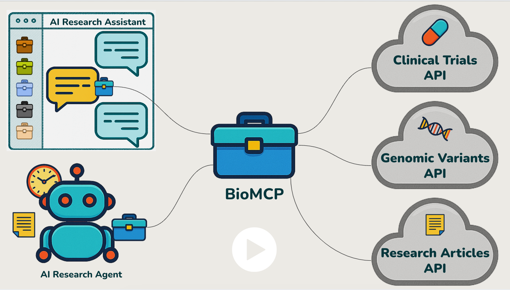

# BioMCP: Biomedical Model Context Protocol

BioMCP is an open source (MIT License) toolkit that empowers AI assistants and
agents with specialized biomedical knowledge. Built following the Model Context
Protocol (MCP), it connects AI systems to authoritative biomedical data
sources, enabling them to answer questions about clinical trials, scientific
literature, and genomic variants with precision and depth.

[](https://www.youtube.com/watch?v=bKxOWrWUUhM)

## MCPHub Certification

BioMCP is certified by [MCPHub](https://mcphub.com/mcp-servers/genomoncology/biomcp). This certification ensures that BioMCP follows best practices for Model Context Protocol implementation and provides reliable biomedical data access.

## Why BioMCP?

While Large Language Models have broad general knowledge, they often lack
specialized domain-specific information or access to up-to-date resources.
BioMCP bridges this gap for biomedicine by:

- Providing **structured access** to clinical trials, biomedical literature,
  and genomic variants
- Enabling **natural language queries** to specialized databases without
  requiring knowledge of their specific syntax
- Supporting **biomedical research** workflows through a consistent interface
- Functioning as an **MCP server** for AI assistants and agents

## Biomedical Data Sources

BioMCP integrates with multiple biomedical data sources:

### Literature Sources

- **PubTator3/PubMed** - Peer-reviewed biomedical literature with entity annotations
- **bioRxiv/medRxiv** - Preprint servers for biology and health sciences
- **Europe PMC** - Open science platform including preprints

### Clinical & Genomic Sources

- **ClinicalTrials.gov** - Clinical trial registry and results database
- **NCI Clinical Trials Search API** - National Cancer Institute's curated cancer trials database
  - Advanced search filters (biomarkers, prior therapies, brain metastases)
  - Organization and intervention databases
  - Disease vocabulary with synonyms
- **BioThings Suite** - Comprehensive biomedical data APIs:
  - **MyVariant.info** - Consolidated genetic variant annotation
  - **MyGene.info** - Real-time gene annotations and information
  - **MyDisease.info** - Disease ontology and synonym information
  - **MyChem.info** - Drug/chemical annotations and properties
- **TCGA/GDC** - The Cancer Genome Atlas for cancer variant data
- **1000 Genomes** - Population frequency data via Ensembl
- **cBioPortal** - Cancer genomics portal with mutation occurrence data
- **OncoKB** - Precision oncology knowledge base for clinical variant interpretation (demo server with BRAF, ROS1, TP53)
  - Therapeutic implications and FDA-approved treatments
  - Oncogenicity and mutation effect annotations
  - Works immediately without authentication

### Regulatory & Safety Sources

- **OpenFDA** - FDA regulatory and safety data:
  - **Drug Adverse Events (FAERS)** - Post-market drug safety reports
  - **Drug Labels (SPL)** - Official prescribing information
  - **Device Events (MAUDE)** - Medical device adverse events, with genomic device filtering

## Available MCP Tools

BioMCP provides 12 specialized tools for biomedical research:

### Core Tools (3)

#### 1. Think Tool (ALWAYS USE FIRST!)

**CRITICAL**: The `think` tool MUST be your first step for ANY biomedical research task.

```python
# Start analysis with sequential thinking
think(
    thought="Breaking down the query about BRAF mutations in melanoma...",
    thoughtNumber=1,
    totalThoughts=3,
    nextThoughtNeeded=True
)
```

The sequential thinking tool helps:

- Break down complex biomedical problems systematically
- Plan multi-step research approaches
- Track reasoning progress
- Ensure comprehensive analysis

#### 2. Search Tool

The search tool supports two modes:

##### Unified Query Language (Recommended)

Use the `query` parameter with structured field syntax for powerful cross-domain searches:

```python
# Simple natural language
search(query="BRAF melanoma")

# Field-specific search
search(query="gene:BRAF AND trials.condition:melanoma")

# Complex queries
search(query="gene:BRAF AND variants.significance:pathogenic AND articles.date:>2023")

# Get searchable fields schema
search(get_schema=True)

# Explain how a query is parsed
search(query="gene:BRAF", explain_query=True)
```

**Supported Fields:**

- **Cross-domain**: `gene:`, `variant:`, `disease:`
- **Trials**: `trials.condition:`, `trials.phase:`, `trials.status:`, `trials.intervention:`
- **Articles**: `articles.author:`, `articles.journal:`, `articles.date:`
- **Variants**: `variants.significance:`, `variants.rsid:`, `variants.frequency:`

##### Domain-Based Search

Use the `domain` parameter with specific filters:

```python
# Search articles (includes automatic cBioPortal integration)
search(domain="article", genes=["BRAF"], diseases=["melanoma"])

# Search with mutation-specific cBioPortal data
search(domain="article", genes=["BRAF"], keywords=["V600E"])
search(domain="article", genes=["SRSF2"], keywords=["F57*"])  # Wildcard patterns

# Search trials
search(domain="trial", conditions=["lung cancer"], phase="3")

# Search variants
search(domain="variant", gene="TP53", significance="pathogenic")
```

**Note**: When searching articles with a gene parameter, cBioPortal data is automatically included:

- Gene-level summaries show mutation frequency across cancer studies
- Mutation-specific searches (e.g., "V600E") show study-level occurrence data
- Cancer types are dynamically resolved from cBioPortal API

#### 3. Fetch Tool

Retrieve full details for a single article, trial, or variant:

```python
# Fetch article details (supports both PMID and DOI)
fetch(domain="article", id="34567890")  # PMID
fetch(domain="article", id="10.1101/2024.01.20.23288905")  # DOI

# Fetch trial with all sections
fetch(domain="trial", id="NCT04280705", detail="all")

# Fetch variant details
fetch(domain="variant", id="rs113488022")
```

**Domain-specific options:**

- **Articles**: `detail="full"` retrieves full text if available
- **Trials**: `detail` can be "protocol", "locations", "outcomes", "references", or "all"
- **Variants**: Always returns full details

### Domain Tools (9)

BioMCP provides action-based consolidated tools for direct access to specific domains:

#### 1. article - PubMed & Biomedical Literature

```python
# Search for articles
article(action="search", genes=["BRAF"], diseases=["melanoma"])

# Get article details
article(action="get", id="38768446")  # PMID, PMC ID, or DOI
```

Actions: `search`, `get`

#### 2. trial - Clinical Trials

```python
# Search for trials
trial(action="search", conditions=["lung cancer"], phase="PHASE3")

# Get complete trial details
trial(action="get", nct_id="NCT06524388")

# Get specific sections
trial(action="get_protocol", nct_id="NCT06524388")
trial(action="get_locations", nct_id="NCT06524388")
trial(action="get_outcomes", nct_id="NCT06524388")
trial(action="get_references", nct_id="NCT06524388")
```

Actions: `search`, `get`, `get_protocol`, `get_locations`, `get_outcomes`, `get_references`

#### 3. variant - Genetic Variants

```python
# Search for variants
variant(action="search", gene="TP53", significance="pathogenic")

# Get variant details
variant(action="get", id="rs113488022")
```

Actions: `search`, `get`

#### 4. alphagenome - AI Variant Predictions

```python
# Predict regulatory effects (requires alphagenome package)
alphagenome(
    chromosome="chr7",
    position=140753336,
    reference="A",
    alternate="T",
    api_key="YOUR_KEY"
)
```

Optional tool requiring separate installation: `uv pip install alphagenome`

#### 5. gene - Gene Information

```python
# Get gene details
gene(action="get", gene_id_or_symbol="TP53")
```

Actions: `get`

#### 6. disease - Disease Information

```python
# Get disease details
disease(action="get", disease_id_or_name="GIST")
```

Actions: `get`

#### 7. drug - Drug/Chemical Information

```python
# Get drug details
drug(action="get", drug_id_or_name="aspirin")
```

Actions: `get`

#### 8. fda - FDA Regulatory Data

```python
# Search adverse events
fda(domain="adverse", action="search", brand_name="keytruda")

# Get drug label
fda(domain="label", action="get", product_ndc="0069-0123")

# Search device events
fda(domain="device", action="search", device_name="pacemaker")
```

Domains: `adverse`, `label`, `device`, `approval`, `recall`, `shortage`
Actions: `search`, `get`

#### 9. nci - NCI Clinical Trials Databases

```python
# Search organizations
nci(resource="organization", action="search", name="MD Anderson", api_key="YOUR_KEY")

# Get organization details
nci(resource="organization", action="get", id="ORG123", api_key="YOUR_KEY")

# Search interventions
nci(resource="intervention", action="search", name="pembrolizumab", api_key="YOUR_KEY")

# Search biomarkers
nci(resource="biomarker", action="search", name="PD-L1", api_key="YOUR_KEY")

# Search diseases
nci(resource="disease", action="search", name="melanoma", api_key="YOUR_KEY")
```

Resources: `organization`, `intervention`, `biomarker`, `disease`
Actions: `search`, `get` (biomarker and disease support search only)

**Note**: Tools that search by gene automatically include cBioPortal summaries when applicable. Use the `search` and `fetch` core tools for unified cross-domain queries.

## Quick Start

### For Claude Desktop Users

1. **Install `uv`** if you don't have it (recommended):

   ```bash
   # MacOS
   brew install uv

   # Windows/Linux
   pip install uv
   ```

2. **Configure Claude Desktop**:
   - Open Claude Desktop settings
   - Navigate to Developer section
   - Click "Edit Config" and add:
   ```json
   {
     "mcpServers": {
       "biomcp": {
         "command": "uv",
         "args": ["run", "--with", "biomcp-python", "biomcp", "run"]
       }
     }
   }
   ```
   - Restart Claude Desktop and start chatting about biomedical topics!

### Python Package Installation

```bash
# Using pip
pip install biomcp-python

# Using uv (recommended for faster installation)
uv pip install biomcp-python

# Run directly without installation
uv run --with biomcp-python biomcp trial search --condition "lung cancer"
```

## Configuration

### Environment Variables

BioMCP supports optional environment variables for enhanced functionality:

```bash
# cBioPortal API authentication (optional)
export CBIO_TOKEN="your-api-token"  # For authenticated access
export CBIO_BASE_URL="https://www.cbioportal.org/api"  # Custom API endpoint

# OncoKB demo server (optional - advanced users only)
# By default: Uses free demo server with BRAF, ROS1, TP53 (no setup required)
# For full gene access: Set ONCOKB_TOKEN from your OncoKB license
# export ONCOKB_TOKEN="your-oncokb-token"  # www.oncokb.org/account/settings

# Performance tuning
export BIOMCP_USE_CONNECTION_POOL="true"  # Enable HTTP connection pooling (default: true)
export BIOMCP_METRICS_ENABLED="false"     # Enable performance metrics (default: false)
```

## Running BioMCP Server

BioMCP supports multiple transport protocols to suit different deployment scenarios:

### Local Development (STDIO)

For direct integration with Claude Desktop or local MCP clients:

```bash
# Default STDIO mode for local development
biomcp run

# Or explicitly specify STDIO
biomcp run --mode stdio
```

### HTTP Server Mode

BioMCP supports multiple HTTP transport protocols:

#### Legacy SSE Transport (Worker Mode)

For backward compatibility with existing SSE clients:

```bash
biomcp run --mode worker
# Server available at http://localhost:8000/sse
```

#### Streamable HTTP Transport (Recommended)

The new MCP-compliant Streamable HTTP transport provides optimal performance and standards compliance:

```bash
biomcp run --mode streamable_http

# Custom host and port
biomcp run --mode streamable_http --host 127.0.0.1 --port 8080
```

Features of Streamable HTTP transport:

- Single `/mcp` endpoint for all operations
- Dynamic response mode (JSON for quick operations, SSE for long-running)
- Session management support (future)
- Full MCP specification compliance (2025-03-26)
- Better scalability for cloud deployments

### Deployment Options

#### Docker

```bash
# Build the Docker image locally
docker build -t biomcp:latest .

# Run the container
docker run -p 8000:8000 biomcp:latest biomcp run --mode streamable_http
```

#### Cloudflare Workers

The worker mode can be deployed to Cloudflare Workers for global edge deployment.

Note: All APIs work without authentication, but tokens may provide higher rate limits.

## Command Line Interface

BioMCP provides a comprehensive CLI for direct database interaction:

```bash
# Get help
biomcp --help

# Run the MCP server
biomcp run

# Article search examples
biomcp article search --gene BRAF --disease Melanoma  # Includes preprints by default
biomcp article search --gene BRAF --no-preprints      # Exclude preprints
biomcp article get 21717063 --full

# Clinical trial examples
biomcp trial search --condition "Lung Cancer" --phase PHASE3
biomcp trial search --condition melanoma --source nci --api-key YOUR_KEY  # Use NCI API
biomcp trial get NCT04280705 Protocol
biomcp trial get NCT04280705 --source nci --api-key YOUR_KEY  # Get from NCI

# Variant examples with external annotations
biomcp variant search --gene TP53 --significance pathogenic
biomcp variant get rs113488022  # Includes TCGA, 1000 Genomes, and cBioPortal data by default
biomcp variant get rs113488022 --no-external  # Core annotations only

# OncoKB integration (uses free demo server automatically)
biomcp variant search --gene BRAF --include-oncokb  # Works with BRAF, ROS1, TP53

# NCI-specific examples (requires NCI API key)
biomcp organization search "MD Anderson" --api-key YOUR_KEY
biomcp organization get ORG123456 --api-key YOUR_KEY
biomcp intervention search pembrolizumab --api-key YOUR_KEY
biomcp intervention search --type Device --api-key YOUR_KEY
biomcp biomarker search "PD-L1" --api-key YOUR_KEY
biomcp disease search melanoma --source nci --api-key YOUR_KEY
```

## Testing & Verification

Test your BioMCP setup with the MCP Inspector:

```bash
npx @modelcontextprotocol/inspector uv run --with biomcp-python biomcp run
```

This opens a web interface where you can explore and test all available tools.

## Enterprise Version: OncoMCP

OncoMCP extends BioMCP with GenomOncology's enterprise-grade precision oncology
platform (POP), providing:

- **HIPAA-Compliant Deployment**: Secure on-premise options
- **Real-Time Trial Matching**: Up-to-date status and arm-level matching
- **Healthcare Integration**: Seamless EHR and data warehouse connectivity
- **Curated Knowledge Base**: 15,000+ trials and FDA approvals
- **Sophisticated Patient Matching**: Using integrated clinical and molecular
  profiles
- **Advanced NLP**: Structured extraction from unstructured text
- **Comprehensive Biomarker Processing**: Mutation and rule processing

Learn more: [GenomOncology](https://genomoncology.com/)

## MCP Registries

[](https://smithery.ai/server/@genomoncology/biomcp)

<a href="https://glama.ai/mcp/servers/@genomoncology/biomcp">

</a>

## Example Use Cases

### Gene Information Retrieval

```python
# Get comprehensive gene information
gene(action="get", gene_id_or_symbol="TP53")
# Returns: Official name, summary, aliases, links to databases
```

### Disease Synonym Expansion

```python
# Get disease information with synonyms
disease(action="get", disease_id_or_name="GIST")
# Returns: "gastrointestinal stromal tumor" and other synonyms

# Search trials (unified search tool can expand disease synonyms)
search(domain="trial", conditions=["GIST"])
# Or use direct trial tool
trial(action="search", conditions=["GIST"])
```

### Integrated Biomedical Research

```python
# 1. Always start with thinking
think(thought="Analyzing BRAF V600E in melanoma treatment", thoughtNumber=1)

# 2. Get gene context
gene(action="get", gene_id_or_symbol="BRAF")

# 3. Search for pathogenic variants with OncoKB clinical interpretation (uses free demo server)
variant(action="search", gene="BRAF", hgvsp="V600E", significance="pathogenic", include_oncokb=True)

# 4. Find relevant clinical trials
trial(action="search", conditions=["melanoma"], interventions=["BRAF inhibitor"])
```

## Documentation

For comprehensive documentation, visit [https://biomcp.org](https://biomcp.org)

### Developer Guides

- [HTTP Client Guide](./docs/http-client-guide.md) - Using the centralized HTTP client
- [Migration Examples](./docs/migration-examples.md) - Migrating from direct HTTP usage
- [Error Handling Guide](./docs/error-handling.md) - Comprehensive error handling patterns
- [Integration Testing Guide](./docs/integration-testing.md) - Best practices for reliable integration tests
- [Third-Party Endpoints](./THIRD_PARTY_ENDPOINTS.md) - Complete list of external APIs used
- [Testing Guide](./docs/development/testing.md) - Running tests and understanding test categories

## Development

### Running Tests

```bash
# Run all tests (including integration tests)
make test

# Run only unit tests (excluding integration tests)
uv run python -m pytest tests -m "not integration"

# Run only integration tests
uv run python -m pytest tests -m "integration"
```

**Note**: Integration tests make real API calls and may fail due to network issues or rate limiting.
In CI/CD, integration tests are run separately and allowed to fail without blocking the build.

## BioMCP Examples Repo

Looking to see BioMCP in action?

Check out the companion repository:
👉 **[biomcp-examples](https://github.com/genomoncology/biomcp-examples)**

It contains real prompts, AI-generated research briefs, and evaluation runs across different models.
Use it to explore capabilities, compare outputs, or benchmark your own setup.

Have a cool example of your own?
**We’d love for you to contribute!** Just fork the repo and submit a PR with your experiment.

## License

This project is licensed under the MIT License.
