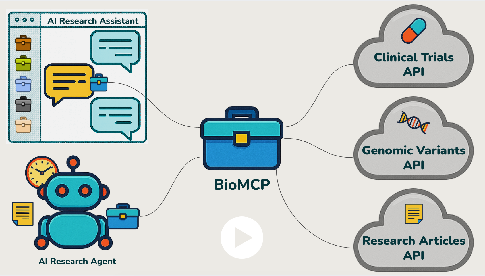

# What is BioMCP?

BioMCP is an open-source implementation of the Model Context Protocol (MCP) designed for biomedical research. It connects AI assistants to specialized biomedical databases, enabling natural language access to complex scientific data.

## The Bridge to Biomedical Data

BioMCP provides AI assistants with direct access to specialized biomedical databases that aren't available through general web search. Built on Anthropic's Model Context Protocol standard, it creates a toolbox that enables natural language queries across multiple scientific data sources.

## Connected Data Sources

- **PubMed/PubTator3**: 30M+ research articles with entity recognition for genes, diseases, drugs, and variants
- **ClinicalTrials.gov**: 400K+ clinical trials searchable by condition, location, phase, and eligibility
- **MyVariant.info**: Comprehensive variant annotations with clinical significance
- **cBioPortal**: Cancer genomics data automatically integrated with searches
- **BioThings APIs**: Real-time gene, drug, and disease information
- **NCI CTS API**: Enhanced cancer trial search with biomarker filtering
- **AlphaGenome**: Variant effect predictions using Google DeepMind's AI

## How Does It Transform Research?

What makes BioMCP particularly powerful is its conversational nature. A
researcher might begin with a simple question about a disease, then naturally
progress to exploring related clinical trials, and finally investigate genetic
variants that affect treatment efficacy—all within a single, flowing
conversation.

The system remembers context throughout the interaction, allowing for natural
follow-up questions and a research experience that mirrors how scientists
actually work. Instead of requiring researchers to master complex query
languages for each database, BioMCP translates natural language into the
precise syntax each system requires.

## Why This Matters

BioMCP represents a significant advancement in making specialized biomedical
knowledge accessible. For researchers and clinicians, it means spending less
time wrestling with complex database interfaces and more time advancing their
work. For the broader field of AI in healthcare, it demonstrates how
specialized knowledge domains can be made accessible through conversation.

As both AI assistants (synchronous conversation partners) and AI agents (
autonomous systems working toward goals over time) continue to evolve, tools
like BioMCP will be essential in connecting these systems to the specialized
knowledge they need to deliver meaningful insights in complex domains.

By open-sourcing BioMCP, we're inviting the community to build upon this
foundation, creating more powerful and accessible tools for biomedical research
and ultimately accelerating the pace of scientific discovery.
